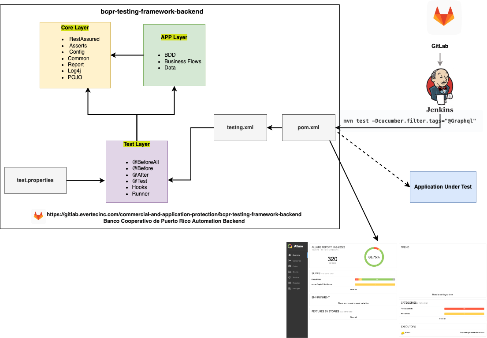
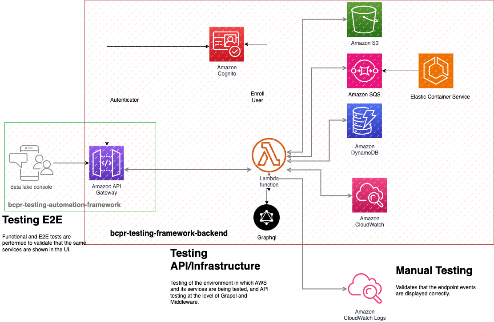

 # bcpr-testing-framework-backend
This README is just a description of this repository and how to maintain the API documentation under it.
install and learn the backend framework for API testing and AWS infrastructure.
## Requirements:

* Install Java 11 [Know more](#know-more)
* Install Maven [Know more](#know-more)
* Create environment variable (JAVA_HOME and MAVEN_HOME) 
    
# API Framework description

## Structure

The framework follows the *API Rest* below is the architecture of the framework, this is a *default type for QA automation* scenarios. The structure of the framework is:



- **Common**: In this package you define the *common classes to be accessed by any other class in the project*, for example: Constants, Enum, Common Models.
- **Config**: Is defined the classes that help with any configuration in the framework, for example: *Rest Assured, Credentials and also the related classes*.
- **Runner**: Contains the cucumber runner class **GraphQLTestRunner** Run all scenarios containing the @Graphql tag and class **MiddlewareTestRunner** Run all scenarios containing the @Middleware tag. In addition to having classes to run scenarios such as **PasswordPolicyRunner** and **SecondChanceTag**
- **StepDefinitions**: Contains the *classes that match with the Gherkin language* defined in the steps for the scenarios on the *feature file*.
- **Hooks**: Contains BeforeAll,Before,After hooks for to create access with credentials AWS, and build the correct data
- **Test**: Contains classes such as EnvBCPRTest *to test AWS environments and infrastructure, validating lambdas handling, DynamoDB tables, cognito created users, SQS queues, etc.*, CreateUserEnvBCPRTest *allows you to create test users in AWS cognito based on the selected environment*, ConfigurationTest *allows you to create test methods before publishing them in the configurations.*
- **Resources**, Contains the *project resources in general*, for example, *log4j.properties*, *features.middleware and features.graphql files*, *data* , *test.properties*; in other projects could be the web view templates as well.

[Know more](#know-more)

## Integration
The framework has several integrations with AWS services that are used for integration and infrastructure testing. As can be seen in this diagram.



## Viewing the results

* The framework uses the **Allure Report Plugin** to generate the report view for each executed test.
* In a **target/ directory**, a folder called 'allure-results' has been generated.
* To run it you must go to path of **target/ directory** and run the following command:
```shell
  allure generate .\allure-results --output .\allure-report --clean ; allure open --port 5000
```
* You should be able to select the scenario you want to run and add in the configuration parameters the plugin if you do not want to run it in the terminal:
 ```shell
 --plugin
  io.qameta.allure.cucumber5jvm.AllureCucumber5Jvm

#Running Scenarios using Tags from Command Line for Middleware

```
mvn test -Dcucumber.filter.tags="@Middleware"
```

#Running Scenarios using Tags from Command Line for Graphql

```
mvn test -Dcucumber.filter.tags="@Graphql"
```

#Configuration to exclude SKIPPED, BROKEN tests in Allure Report
Skipped
```
grep -rl '"status": "skipped"' allure-results | xargs rm -rf
```
Broken
```
grep -rl '"status": "broken"' allure-results | xargs rm -rf
```

#Configuration to count files result.json tests in Allure Report
```
ls -1q target/allure-results/*result.json | wc -l
```
#run report
```
mvn allure:serve
```

#System messages
POST body missing. Did you forget use body-parser middleware?
--likely forgot add body to request. 

#run TESTNG test
java -classpath "./src/test/java/test/jar/*:./target/test-classes" org.testng.TestNG ./testng.xml

```
## Know more
* **Graphql**: A query language for your API. GraphQL is a query language for APIs and a runtime for fulfilling those queries with your existing data. [Read more](https://graphql.org/)
* **Rest Assured**: Testing and validating REST services in Java is harder than in dynamic languages such as Ruby and Groovy.  [Read more](https://rest-assured.io/)
* **Cucumber**: Is a tool that supports Behaviour-Driven Development(BDD) [Read more](https://cucumber.io/)
* **Gherkin**: Is a business readable language which helps you to describe business behavior without going into details of implementation. [Read more](https://cucumber.io/docs/gherkin/reference/)
* **BDD**: Behavior-driven development (BDD) is an Agile software development methodology in which an application is documented and designed around the behavior a user [Read more](https://federico-toledo.com/que-es-bdd/)
* **Allure report**: Is a flexible, lightweight multi-language test reporting tool. It provides clear graphical reports and allows everyone involved in the development process to extract the maximum of information from the everyday testing process. [Read more](https://allurereport.org/docs/#_testng)
* **Maven**: Apache Maven is a software project management and comprehension tool. Based on the concept of a project object model (POM), Maven can manage a project's build, [Read more](https://www.digitalocean.com/community/tutorials/maven-commands-options-cheat-sheet)
* **POJO**: POJO in Java stands for Plain Old Java Object. It is an ordinary object, which is not bound by any special restriction. [Read more](https://www.arquitecturajava.com/que-es-un-pojo-en-java/)
* **Log4J**: The Apache Log4j Project is among the most deployed pieces of open source software, providing logging capabilities for Java applications. [Read more](https://logging.apache.org/log4j/2.x/#:~:text=Log4j%20bundles%20a%20rich%20set,formatted%20outputs)
* **TestNG**: Is an automation testing framework in which NG stands for “Next Generation”. TestNG is inspired by JUnit which uses the annotations [Read more](https://testng.org/doc/documentation-main.html)
* Install **Java**: [Install link](https://www.oracle.com/java/technologies/javase/javase-jdk8-downloads.html)
* Install **Maven**: [Install link](https://maven.apache.org/download.cgi)
 
# Team

* Yuliet.Sosa@evertecinc.com
* Mervin.Diaz@evertecinc.com
* Hector.Vergara@evertecinc.com
* Carlos.Jara@evertecinc.com
